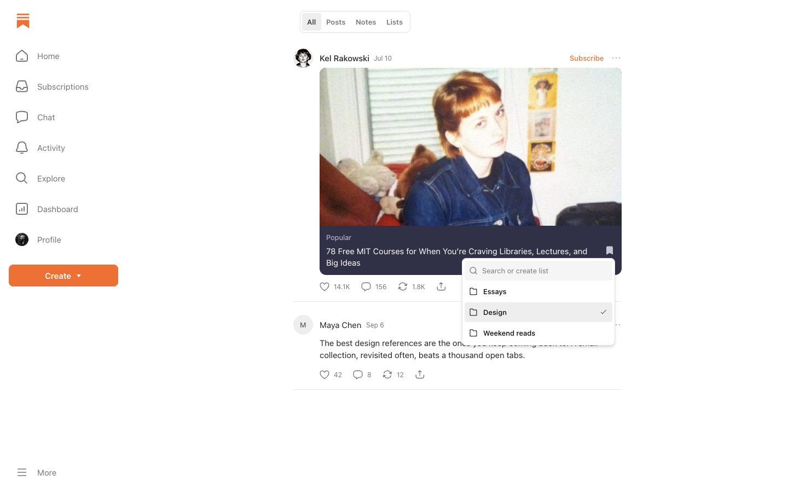
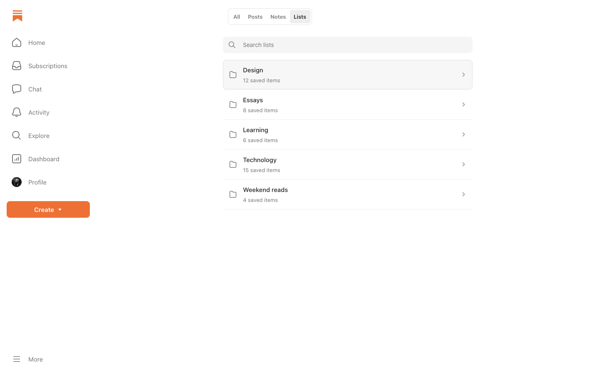
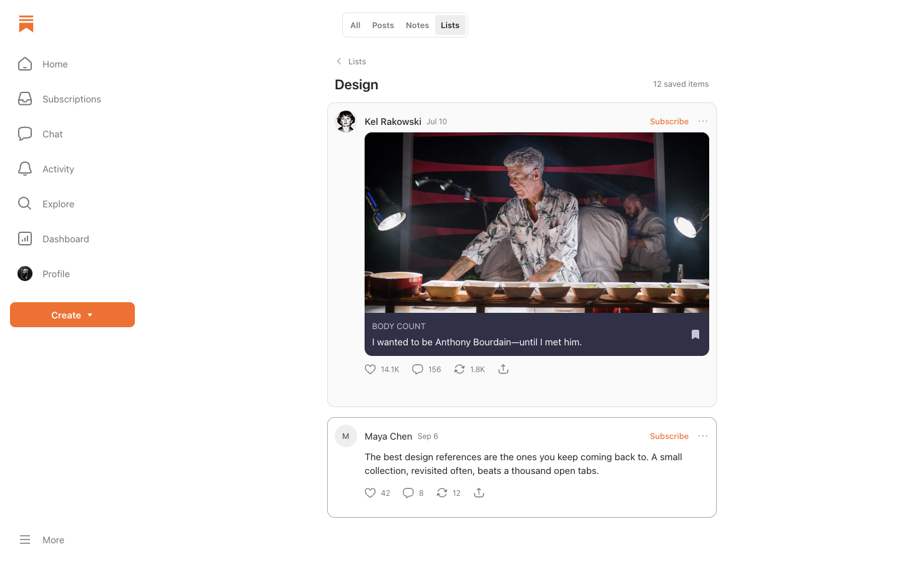

# Sublists

Save Substack posts and Notes into lists in Apple Notes. Uses Substack's normal Save button and adds a **Lists** tab to Saved.

<details>
<summary>Screenshots</summary>

Choose a list when saving:



Create a list and save the item:


Browse and search your lists:



View the items in a list:



*Design previews.*

</details>

## Install

Requires a Mac, Chrome, and Python 3.9+. No GitHub account or GitHub CLI needed.

Run in Terminal:

```sh
curl -fsSL https://raw.githubusercontent.com/ankitiscracked/sublists/main/install.sh | bash
```

The script installs the files and companion, then opens Chrome and reveals the extension folder. No sudo or extension ID to copy.

1. In Chrome, enable **Developer mode**, click **Load unpacked**, and select the revealed `extension` folder.
2. Refresh Substack. Save an item, choose or create a list, and allow Notes access when macOS asks.

Find your notes under **Apple Notes → Substack**, and your lists under **Substack → Saved → Lists**.

## Update

Run the same command, click **Reload** for Sublists in `chrome://extensions`, then refresh Substack. Your notes stay intact.

## Troubleshooting

- Connection issue: click **Try again** in the save picker. Use **Set up Apple Notes** or **Setup help** for installation instructions.
- Notes permission denied: enable Notes under **System Settings → Privacy & Security → Automation**.

The Sublists extension icon opens **Saved → Lists**.

Installed in `~/Library/Application Support/Sublists`. No server or subscription. This works in desktop Chrome, not the Substack mobile app.
